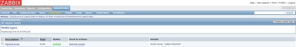

Wstęp
=====

Proces integracji został przeprowadzony na Ubuntu (konkretnie 12.04 LTS).

Zarówno serwer jak i agenty Zabbixa są w wersji 2.0.4. i zostały zainstalowane z wykorzystaniem repozytorium PPA [http://ppa.launchpad.net/tbfr/zabbix/ubuntu](http://ppa.launchpad.net/tbfr/zabbix/ubuntu), gdyż standardowe repozytoria zawierają starszą wersję.

Przykładowy sposób instalacji można znaleźć np. tutaj [http://www.sysadminworld.com/2013/install-zabbix-2-on-ubuntu-12-04-precise/](http://www.sysadminworld.com/2013/install-zabbix-2-on-ubuntu-12-04-precise/). 

Przygotowanie skryptów integracji
=================================

Zaczynamy od przygotowania skryptów integracji.

By wysyłać powiadomienia wykorzystamy dwa skrypty.

Pierwszy to konsolowy skrypt bashowy pozwalający wysłać powiadomienie do HipChata (wykorzystuje bezpośrednie połączenie z API HipChata).

Drugi będzie natomiast skryptem pośredniczącym między wywołaniami Zabbixa, a pierwszym skryptem.

W roli tego pierwszego użyjemy skryptu ze strony  [https://github.com/hipchat/hipchat-cli](https://github.com/hipchat/hipchat-cli).

Pobieramy i umieszczamy plik z kodem w ``/usr/local/bin/hipchat_room_message``.

    wget https://raw.github.com/hipchat/hipchat-cli/master/hipchat_room_message
    # lub
    git clone https://github.com/hipchat/hipchat-cli.git .
    
    sudo mv hipchat_room_message /usr/local/bin/
    sudo chmod +x /usr/local/bin/hipchat_room_message

Następnie pobieramy drugi skrypt (``zabbix2hipchat``), umieszczamy go w katalogu skryptów notyfikacji Zabbixa ``/etc/zabbix/alert.d/`` i nadajemy atrybut wykonywalności (``chmod +x``).

    wget https://raw.github.com/xsolve-pl/zabbix2hipchat/master/zabbix2hipchat
    # lub
    git clone git@github.com:f4il/zabbix2hipchat.git .
    
    sudo mv zabbix2hipchat /usr/local/bin/
    sudo chmod +x /usr/local/bin/zabbix2hipchat
    

Modyfikujemy wedle potrzeb wartości dla zmiennych ``KEY``, ``ROOM_NAME``, ``FROM_LABEL``.
- ``KEY`` - klucz dostępowy (token) do API HipChata 
- ``ROOM_NAME`` - nazwa pokoju
- ``FROM_LABEL`` - etykieta nadawcy.

Generlanie skrypt przjmuje trzy parametry (domyślnie przekazywane przez Zabbixa) - kolejno:

* 1: adres mailowy na jaki jest ustawiona akcja Zabbixa (tu nie będzie on wykorzystywany)
* 2: temat
* 3: treść powiadomienia.

Zawartość pola **"temat"** została użyta jako parametr sterujący ustawianiem koloru notyfikacji w HipChat (patrz konfiguracja treści notyfikacji w dalszej części).

Na końcu testujemy poprawność instalacji - uruchamiamy poniższe polecenia i sprawdzamy czy powiadomienia pokazują się na HipChat.

    # OK
    /usr/local/bin/zabbix2hipchat "some@email.com" "OK" "Test message"
    # PROBLEM
    /usr/local/bin/zabbix2hipchat "some@email.com" "PROBLEM" "Test message"
   

Konfiguracja MediaType
======================

Dodajemy nowy typ **Media Type** jak w poniższych zrzutach:

Konfiguracja grupy i użytkownika
================================

Przygotowujemy najpierw grupę jak niżej:

Następnie tworzymy użytkownika "Zabbix" jak niżej:

 

Konfiguracja akcji
==================

Na końcu konfigurujemy nową akcję, która będzie wysyłała powiadomienia:

Treść komunikatu:

    Host: {HOST.NAME1}
    Status: {TRIGGER.STATUS}
    Severity: {TRIGGER.SEVERITY}
    Trigger: {TRIGGER.NAME}
    Trigger URL: {TRIGGER.URL}

    {ITEM.NAME1}: {ITEM.VALUE1}

